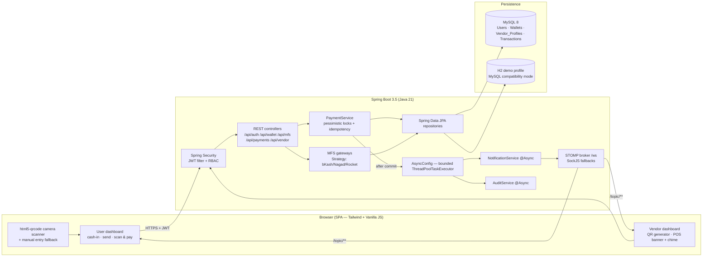
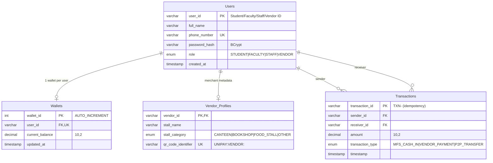
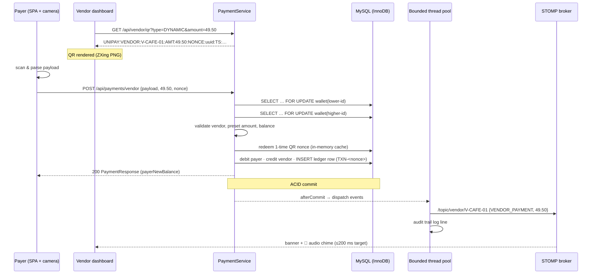
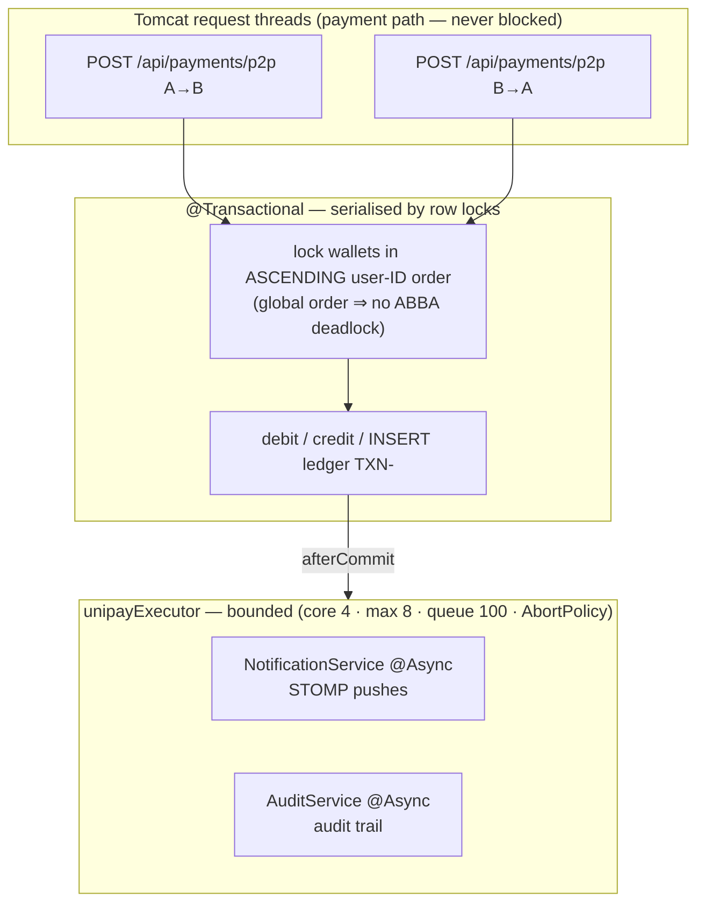

# UniPay — Architecture

Advanced OOP (CSE 3118 / CSE 2118) · UIU · Group 2, Section J

## 1. Component view

## 2. ER model (exact proposal schema)

## 3. QR vendor payment — sequence

## 4. Threading & concurrency model

**Why the ledger insert is synchronous while notifications are async.** The proposal lists
"transaction logging" among `@Async` workers. UniPay writes the *financial ledger row* inside
the same ACID transaction as the balance updates — otherwise a crash between "balance moved"
and "async ledger write" would lose money history. The *audit trail* and *real-time
notifications* (non-critical I/O) run on the bounded pool exactly as required, dispatched only
after commit via `TransactionSynchronization.afterCommit`.

**Idempotency.** Ledger PK = `TXN-<client nonce>`; a repeated tap re-reads the committed row
and returns it with `duplicate:true` — no second debit, no second credit.

## 5. Real-time channel security

- SockJS handshake accepts `?token=<jwt>` (xhr fallbacks can't send STOMP headers).
- `StompAuthChannelInterceptor` verifies the JWT at STOMP CONNECT and installs the principal.
- `SubscriptionGuardInterceptor` rejects subscriptions to `/topic/**/{someoneElse}`.
- Client reconnects with exponential backoff 1→30 s; after 3 failures it also polls every 15 s
  until the socket returns (proposal risk: connection drops).

## 6. OOP design patterns used (course relevance)

| Pattern | Where |
|---------|-------|
| **Strategy** | `MfsGateway` per provider; `MfsGatewayFactory` registry |
| **Template Method** | `AbstractSimulatedMfsGateway.verify()` shared phone/OTP/limit algorithm, provider-specific latency hook |
| **Adapter** | `AppUserPrincipal` adapts the domain `User` to Spring Security `UserDetails`/`Principal` |
| **Repository / DAO** | Spring Data JPA interfaces over the proposal schema |
| **DTO / Mapper** | `*Dtos` records isolating the API contract from entities |
| **Facade** | `PaymentService` orchestrates locking, idempotency, ledger, events |
| **Producer–Consumer** | bounded `ThreadPoolTaskExecutor` + after-commit event dispatch |
| **Singleton / DI** | Spring components wired by constructor injection throughout |
